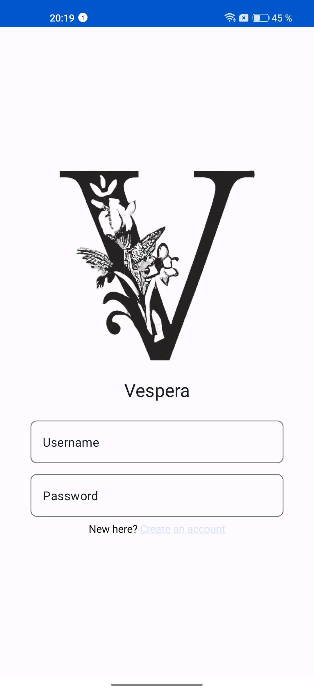

# 🔮 Vespera 🔮

Welcome to the Vespera App repository! 
This mobile app is designed to be your go-to companion for all things League of Legends on the Android platform. 
While the project is currently in the planning phase, we're excited about the potential features and functionalities that will enhance your League of Legends experience.

## Project Overview ✨

The League Companion App aims to provide users with valuable tools, information, and features to streamline their interaction with the League of Legends game. 
Our goal is to create a user-friendly and efficient mobile app that caters to both casual and competitive players.

## Planned Features ⚗️

### 1. Summoner Profile
- View detailed summoner information.
- Track and analyze match history.

### 2. Champion Insights
- Access comprehensive details about champions.
- Stay updated on the latest patches and changes.

### 3. Live Game Tracking
- Monitor live games in real-time.
- Receive notifications for important in-game events.

### 4. Build Recommendations
- Get personalized item and rune suggestions.
- Stay informed about popular builds.

## Development Stack 📚

- The development will leverage Kotlin & Jetpack Compose for a modern and reactive UI.

## Updates

### Screenshots

## How to Contribute

We accept no contributions whatsoever.

## Building and Running the App

As the project is still in the planning stage, detailed instructions for building and running the app will be provided in future updates.

## Contact

Feel free to reach out if you have any questions or suggestions. We're looking forward to creating a fantastic League of Legends companion app together!

**Happy gaming!**
